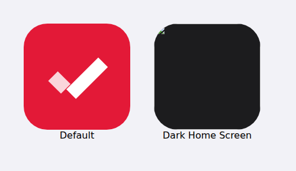
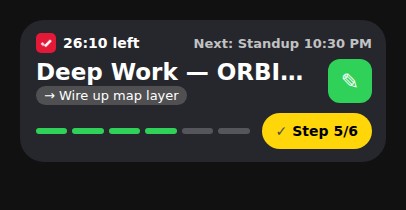

<p align="center">
  
</p>

<h1 align="center">Hyperday</h1>

<p align="center">
  <b>Your day, live on your Lock Screen.</b><br>
  A day-timeline app for iPhone: your calendar and your own plan become one Live Activity that shows what you're doing now, what's next, and how far along you are.
</p>

<p align="center">
  iOS 17+ · Liquid Glass on iOS 26+ · SwiftUI · ActivityKit · EventKit · App Intents
</p>

---

> **Status:** pre-release (v0.1, personal build). Everything runs on-device. Not yet on the App Store or TestFlight.
> Hyperday is an independent project and is not affiliated with, endorsed by, or sponsored by Tesla, Inc. or Apple Inc.

## Contents

- [Why Hyperday](#why-hyperday)
- [Features](#features)
- [How it works](#how-it-works)
- [Privacy](#privacy)
- [Requirements](#requirements)
- [Build and run](#build-and-run)
- [Project structure](#project-structure)
- [Architecture](#architecture)
- [Configuration and data](#configuration-and-data)
- [Known limitations](#known-limitations)
- [Roadmap](#roadmap)
- [Contributing](#contributing)
- [License](#license)

## Why Hyperday

Calendars tell you what is *scheduled*. Hyperday shows what is *happening*: the block you're in, the step you're on, and what's next, right on the Lock Screen and in the Dynamic Island, without opening an app.

It is built for people whose day mixes work meetings, focus time and life: one glance tells you where you are, and a tap checks off the next step.

<p align="center">
  
</p>

## Features

### Live Activity (Lock Screen + Dynamic Island)
- **Top row:** Hyperday icon, a live countdown for the current block ("26:10 left", ticking on its own), and the next block ("Next: Standup 10:30 PM").
- **Title** of the current block, or "Free until 12:30 PM" / "Day complete" / "Nothing planned".
- **Second line:** the next step as a grey pill (→ Wire up map layer) or, when two blocks overlap, "also: Standup · 10:00–10:15".
- **Segmented bar:** one segment per block in your day, or one per **step** when the current block has a checklist.
- **One-tap action:** a yellow **Step n/N** button that checks the next step, **Done** to finish a block early, or **Start next** during a free gap. It works from the Lock Screen without opening the app.
- **Accent color:** the bar and icon take the live block's category or calendar color.
- **Dynamic Island:** compact (icon + day-progress ring), minimal (ring) and expanded (title, countdown, bar and action).

### Today
- A large heading showing what you're doing now, plus **Focused · Steps · Meetings left** at a glance.
- **Add block** and **Go Live / Stop Live** buttons.
- A timeline of calendar events and your own blocks, each with its category color and a red **NOW** marker.
- A **LIVE NOW** pill that opens the live block and its steps.

### Calendar
- **Every calendar on your iPhone** (work, personal, shared), plus your Hyperday tasks.
- **Agenda:** a week strip with category dots, then the days of that week. Tap a date to jump to it; tap it again to return to today.
- **Week:** an hour grid with seven days side by side. Overlapping events split the column, and a now-line marks the current time.
- **Month:** a grid with dots; tap a day to see its items.
- Filters: **Tasks** on/off, **Declined** invites on/off.

### Blocks and steps
- Add a block in about 5 seconds: title, start time, length chips (15m–2h), and a category.
- Tap any block to edit it. For your own blocks you can change the title, time, length, category and steps, or delete the block. Calendar events stay read-only in Hyperday; you can add steps and a category to them.
- **Steps** are checklists inside a block. While the block is live, checked steps fill the Lock Screen bar.

### Categories and colors
- Six starter categories: **Work · Meetings · Deep Work · Fitness · Family · Personal**. You can rename and recolor them, or add new ones.
- **Auto rules**, first match wins, for example: *Title has "1:1, sync, standup" → Meetings*, *Calendar is "Tesla" → Work*. You can reorder rules and choose a fallback category.
- **Manual override** per block (the *Auto · Deep Work* chip).
- **Calendar colors:** give any calendar its own color in Settings › Calendars. It overrides the category color everywhere except Stats. Calendars named "Tesla" start in red.

### Stats
- **Week / Month / Year** with three headline numbers: **Focused** hours, **Steps done**, and **Streak**.
- **Hours by category**, **meeting load** (calendar meetings compared with your own planned time), and blocks **done / ended early / missed**.
- **Sample data** (Settings › Load sample data): 8 weeks of example history plus a planned day, for previewing. It never touches your calendars and can be removed with one tap.

### Look and feel
- Light and dark themes (**System / Light / Dark**, plus a quick toggle in the header), inspired by a minimal automotive web style: wide-spaced wordmark, uppercase labels, outlined chips, flat cards.
- Apple's native tab bar: **Today · Calendar · Stats · Settings**. On iOS 26+ it is Liquid Glass with the press-and-drag lens, and it minimizes when you scroll.
- App icon in default, dark and tinted variants.

### Siri and Shortcuts
- "Hey Siri, **add a block in Hyperday**". Siri asks what the block is and how long it lasts. The same action is available in Shortcuts and on the Action Button.

## How it works

1. Hyperday reads today's events (EventKit) and your planned blocks.
2. `DayEngine` works out what's current, what overlaps, what's next, the bar segments and the day's progress. It is pure Swift logic with no iOS dependencies.
3. `LiveActivityManager` starts or updates the Live Activity with that state, and restarts it before iOS's roughly 8-hour limit.
4. Taps on the card (**Step / Done / Start next**) run an App Intent in the app's process, which updates your data and refreshes the card.
5. Each refresh also writes today's record to the local history, which feeds **Stats**.

## Privacy

- **No accounts, no servers, no analytics, no ads.** Hyperday makes no network requests.
- Calendar access is used only on-device to display your events. Hyperday **never edits or creates** calendar events.
- Your blocks, steps, categories and history are stored as files in the app's private container on your iPhone.
- Deleting the app deletes all of its data.

See [docs/PRIVACY.md](docs/PRIVACY.md) for details.

## Requirements

| | |
|---|---|
| Device | iPhone with iOS 17 or later (Dynamic Island on iPhone 14 Pro and later; Liquid Glass on iOS 26+) |
| Mac | macOS with **Xcode 26 or later** (the Liquid Glass APIs need the iOS 26 SDK) |
| Tools | [Homebrew](https://brew.sh), [XcodeGen](https://github.com/yonaskolb/XcodeGen) (`brew install xcodegen`) |
| Apple account | A free Apple ID works for personal installs (they expire after 7 days). Push updates, TestFlight and the App Store need the [Apple Developer Program](https://developer.apple.com/programs/). |

## Build and run

### One command
```bash
git clone https://github.com/prabhuSub/DayLive-app.git
cd DayLive-app
./deploy.sh
```
`deploy.sh` does the following:
1. Finds your signing team from your Apple Development certificate and saves it in `.team`, which is not committed.
2. Generates the Xcode project from `project.yml`.
3. Builds the app for iOS.
4. Installs and launches it on your connected iPhone (cable, or the same Wi-Fi after one cabled run).

If it can't find your team, run `DEVELOPMENT_TEAM=ABCDE12345 ./deploy.sh`.

### With Xcode
```bash
DEVELOPMENT_TEAM=ABCDE12345 xcodegen generate
open DayLive.xcodeproj
```
Select your iPhone and press ▶︎. The first time, trust the developer profile on the phone: **Settings › General › VPN & Device Management**, and turn on **Developer Mode**.

> The `.xcodeproj` is generated and git-ignored. Edit `project.yml`, not the project file.

### First launch
1. Allow **Full Access** to calendars.
2. Tap **Add block**, or go to **Settings › Load sample data** to explore.
3. Tap **Go Live**, then lock the phone.

## Project structure

```
DayLive/
├── project.yml                  # XcodeGen spec (targets, Info.plist keys, signing)
├── deploy.sh                    # build + install on iPhone
├── App/                         # iOS app target
│   ├── DayLiveApp.swift         # entry point, environment, background refresh
│   ├── Assets.xcassets          # app icon (default/dark/tinted), HyperdayMark
│   ├── Model/
│   │   ├── Block.swift          # Block, Step, BlockOverride
│   │   ├── BlockStore.swift     # planned blocks, steps, overrides, category overrides
│   │   ├── CalendarService.swift# EventKit reads, calendar list
│   │   ├── Category.swift       # categories, rules, calendar colors
│   │   ├── DayEngine.swift      # pure day logic -> Live Activity state
│   │   └── HistoryStore.swift   # daily history, stats, sample data
│   ├── LiveActivity/
│   │   └── LiveActivityManager.swift  # start/update/restart, background refresh
│   ├── Intents/
│   │   └── AddBlockIntent.swift # Siri / Shortcuts
│   └── Views/                   # Today, Calendar, Stats, Settings, sheets, components
├── Shared/                      # compiled into both targets
│   ├── DayActivityAttributes.swift   # Live Activity data contract
│   ├── BlockActionIntent.swift       # Step / Done / Start next button
│   └── LiveActivityViews.swift       # Lock Screen card + pieces
├── Widget/                      # Widget extension (Live Activity UI)
│   ├── DayLiveWidget.swift
│   └── Assets.xcassets          # HyperdayMark icon for the card
└── docs/                        # privacy, architecture, images
```

> Code, targets and bundle IDs still use the original working name **DayLive**; the product name is **Hyperday**.

## Architecture

See [docs/ARCHITECTURE.md](docs/ARCHITECTURE.md). In short:
- **SwiftUI + ObservableObject stores** (`BlockStore`, `CategoryStore`, `HistoryStore`, `LiveActivityManager`), all on the main actor, persisted as JSON.
- **No App Group needed.** The widget only renders `ContentState`, and `LiveActivityIntent`s run in the app process.
- **`DayEngine` is pure**, so it can be unit tested without a device.

## Configuration and data

| File (app Documents) | Contents |
|---|---|
| `daylive-store.json` | planned blocks, steps, Done/Start-next overrides, category overrides |
| `daylive-categories.json` | categories, rules, fallback, calendar colors |
| `daylive-history.json` | one record per day, used by Stats |

Settings stored in `UserDefaults`: `appearance`, `autoStartActivity`, `activityStartedAt`.

## Known limitations

- **Switching at block times is best-effort.** Without push notifications, the card updates when you open the app, tap a button, or when iOS runs a background refresh (which can come late). If it's behind, it shows "Out of date · tap to refresh". This will be fixed by on-time pushes (see the roadmap).
- Live Activities last about 8 hours. Hyperday restarts the activity only while the app is open.
- All-day events are not shown yet.
- Stats count what you tap (Done, steps). Hyperday can't know whether you attended a meeting. "Ran over" isn't measurable, so it isn't shown.
- Personal installs with a free Apple ID expire after 7 days.

## Roadmap

Candidates, not commitments:
- On-time switching with a push server (APNs)
- Heads-up alerts before blocks start or end
- Apple Watch (Smart Stack, tap Step/Done from the wrist)
- Focus mode automation (Deep Work → Focus)
- Day templates ("Office day", "WFH day")
- Drag to move and resize blocks in Week view
- More Siri and Shortcuts ("What's next?", "Check my step")
- Home Screen and StandBy widgets
- Weekly recap card to share
- Weekly goals per category with progress rings
- All-day events, iCloud sync, TestFlight beta

## Contributing

Hyperday is not accepting outside contributions yet. Bug reports and ideas are welcome as GitHub issues. Please include your iOS version, device, and steps to reproduce.

Development notes:
- Keep `DayEngine` free of UI and iOS APIs.
- Anything the widget renders must go through `DayActivityAttributes.ContentState`, which is limited to 4 KB.
- UI changes start as mockups before code.

## License

No license has been chosen yet, so all rights are reserved by default. Copyright © 2026 Prabhu Subramanian.

Tesla is a trademark of Tesla, Inc. Apple, iPhone, Live Activities, Dynamic Island and Liquid Glass are trademarks of Apple Inc. They are used here only descriptively.
