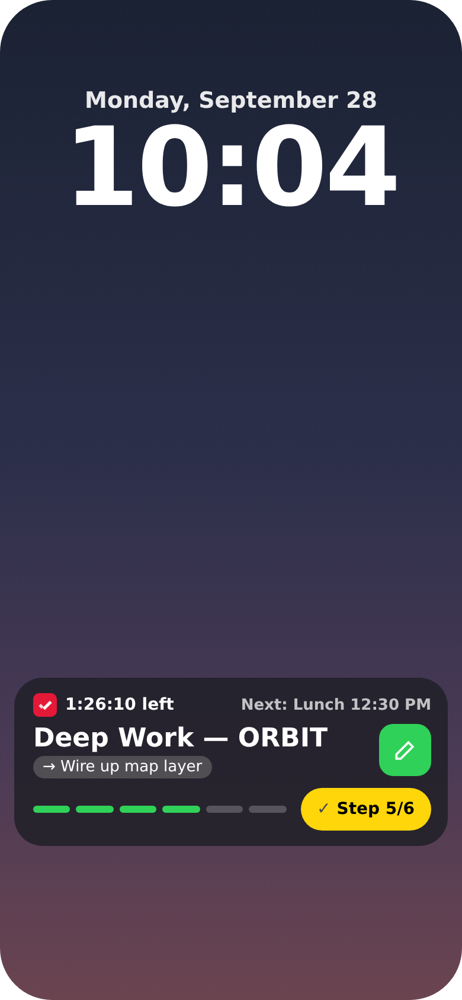
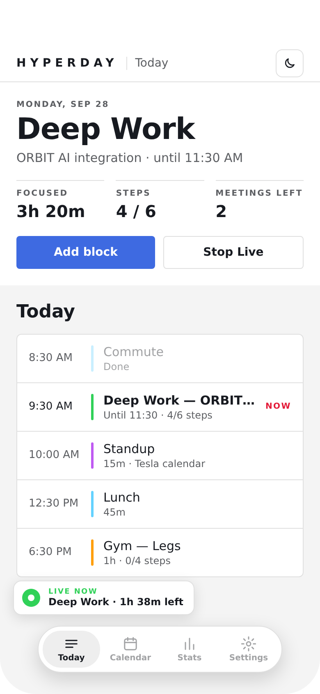
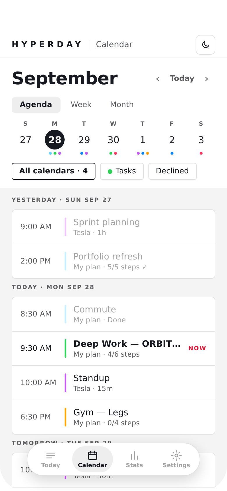
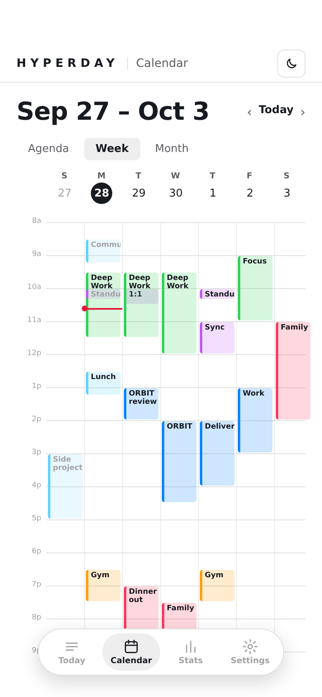
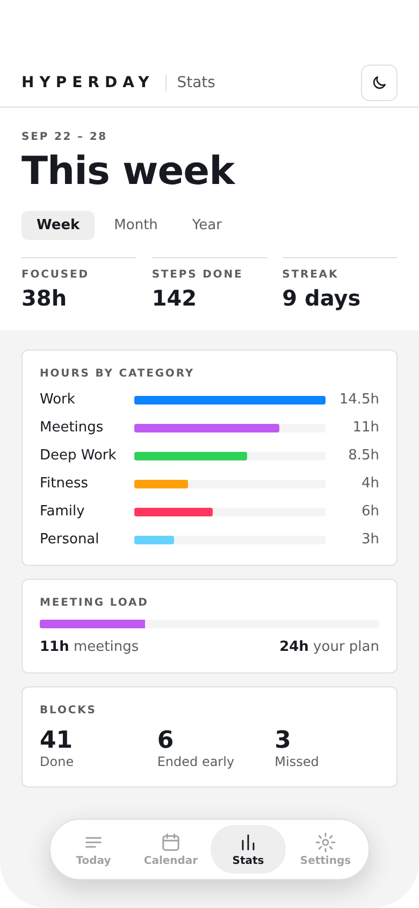
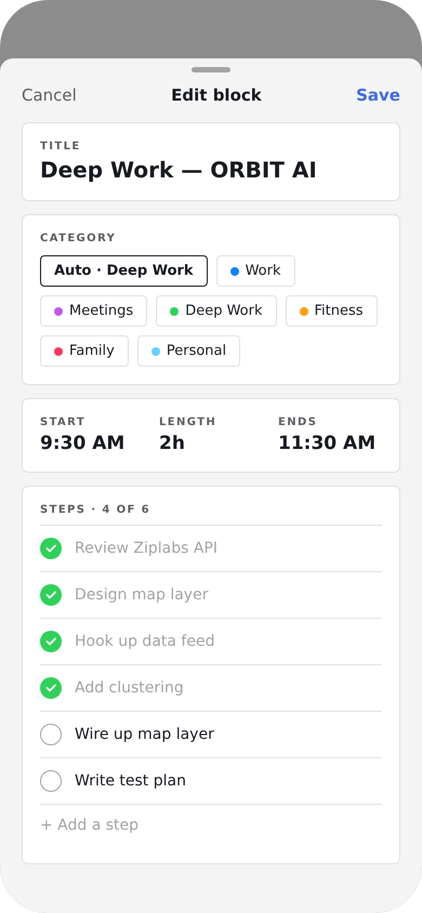
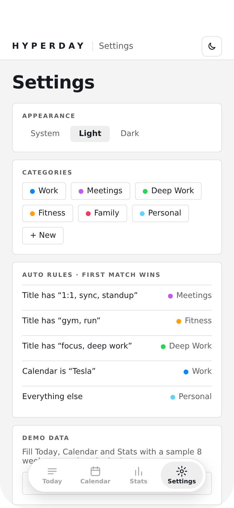
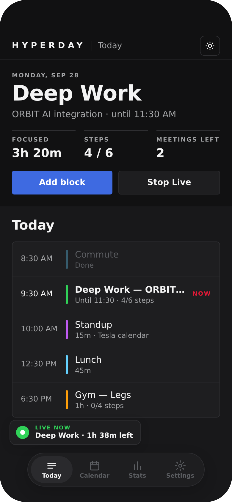

  

<h1 align="center">Hyperday</h1>

  <b>Your day, live on your Lock Screen.</b>

  <a href="#download">Download</a> ·
  <a href="https://github.com/prabhuSub/DayLive-app/issues">Report an issue</a> ·
  <a href="docs/PRIVACY.md">Privacy</a>

  
  
  
  
  
  

---

Hyperday turns your calendar and your own plan into one live card on your iPhone. Glance at your Lock Screen and see **what you're doing now, what's next, and how far along you are**. Tap once to check off a step.

## See it

### Your day on the Lock Screen

The Hyperday card sits on your Lock Screen and in the Dynamic Island all day.

- **Top:** time left in what you're doing, and what's next.
- **Middle:** the block you're in, and your next step.
- **Bar:** fills in as you check off steps.
- **Yellow button:** tap **Step 5/6** to check off a step without unlocking your phone. It turns into **Done** when you finish.

The card takes the color of what you're doing: green for Deep Work, orange for Fitness, red for your work calendar.

**How to start:** open Hyperday and tap **Go Live**, then lock your phone.

 

### Today

Your day at a glance.

- The big title is what you're doing **right now**.
- **Focused · Steps · Meetings left** show how the day is going.
- Below is your timeline: meetings from your calendar and blocks you planned, each in its color. The red **NOW** marks where you are.

**How to use it:** tap **Add block** to plan something (a name, a start time and a length take about 5 seconds). Tap any item to add steps or change it. Tap **LIVE NOW** to jump to what's on your Lock Screen.

 

### Calendar

All your calendars in one place (work, personal, family) together with your own plans.

- **Agenda:** your week, day by day.
- **Week:** hours side by side, so you can see how busy each day is.
- **Month:** the big picture, with colored dots for what's on each day.

**How to use it:** tap a date to jump to it; tap it again to come back to today. Use the **Tasks** and **Declined** chips to show or hide items.

 

### Week view

A classic time grid for the whole week. Overlapping meetings sit side by side, and the red line shows the current time.

**How to use it:** tap any block to see it or add steps.

 

### Stats

See where your time actually goes.

- **Focused hours, steps done** and your **streak** (days you finished everything you planned).
- **Hours by category:** how much went to work, meetings, fitness and family.
- **Meeting load:** meetings compared with time you planned yourself.

**How to use it:** switch between **Week, Month and Year**. New to Hyperday? Go to **Settings › Load sample data** to see it filled in.

 

### Plan with steps

Break any block into small steps. While that block is live, each step is one segment of the bar on your Lock Screen.

**How to use it:** tap a block, type a step and press return, then type the next. Pick a **category** to change its color, or leave it on **Auto**.

 

### Make it yours

- **Light, Dark or System** appearance.
- **Categories:** rename them, recolor them, or add your own.
- **Auto rules:** for example, anything with "gym" in the title is Fitness.
- **Calendar colors:** give each calendar its own color, like red for work.

 

  
   Dark mode

## Also works with

- **Siri & Shortcuts:** say "Hey Siri, add a block in Hyperday".
- **Dynamic Island:** your countdown and progress while you use other apps.

## Privacy

Your day stays on your iPhone.

- No account, no sign-up, no ads, no tracking.
- Hyperday **reads** your calendars to show them. It never changes them.
- Everything you create is stored only on your phone. Delete the app and it's gone.

Read the full [privacy policy](docs/PRIVACY.md).

## Download

Hyperday is in **early preview** and isn't on the App Store yet. Star this repository to hear when the beta opens.

Developers can build it themselves: see [docs/DEVELOPMENT.md](docs/DEVELOPMENT.md).

## Coming soon

- Home Screen and StandBy widgets
- Apple Watch
- More Siri commands ("What's next?", "Check my step")
- Drag to move blocks in Week view
- A weekly recap card to share
- Focus mode support

## FAQ

**Does Hyperday change my calendar?** No. It only reads it. Blocks and steps you create live in Hyperday.

**Does it need internet?** No. Everything works offline.

**Why does the card sometimes lag behind the clock?** iOS decides when apps can refresh in the background. Opening Hyperday or tapping the card's button updates it right away. On-time switching is on the roadmap.

**Which iPhones?** iPhone with iOS 17 or later. The Dynamic Island needs iPhone 14 Pro or newer.

---

Screens shown are design previews and may differ slightly from the current build. Hyperday is an independent project, not affiliated with Apple Inc. or Tesla, Inc. Copyright © 2026 Prabhu Subramanian. All rights reserved.
